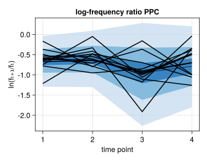
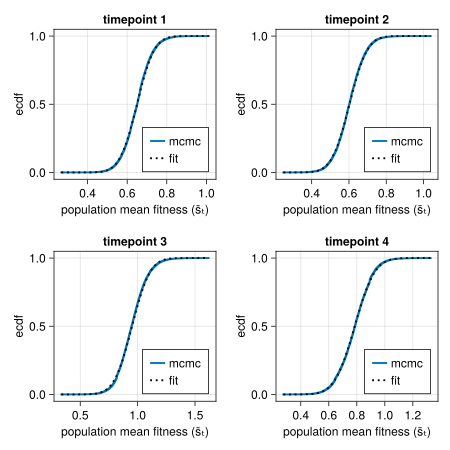

# BayesFitness

Welcome to the documentation of `BayesFitness.jl`! The accompanying paper,
*Bayesian inference of relative fitness on high-throughput pooled competition
assays*, explains all of the biological and mathematical background needed to
understand this package. Here, we only focus on how to use the package, assuming
the user already understands the objective of inferring the posterior
probability distribution of the relative fitness of mutant strains in a pooled
competition assay.

The package is divided into modules. Here's a brief description of the content
of each module, but please visit their respective documentations to understand
what each module is intended for.

- `utils`: Series of miscellaneous functions that make the data wrangling and
  processing much simpler.
- `viz`: [`Makie.jl`](https://docs.makie.org/stable/)-based module with useful
  plotting functions to display the data and the MCMC results for visual
  diagnostics.
- `stats`: Statistical functions used in the inference problem.
- `model`: [`Turing.jl`](https://turing.ml)-based Bayesian models used to infer
  the population mean fitness via the neutral lineages as well as the mutants'
  relative fitness.
- `mcmc`: The main module with which to perform the Markov-Chain Monte Carlo
  sampling of the posterior distributions.
  
## Example inference

To get you going with the package, let's walk through a basic inference pipeline
for one competition assay. Our ultimate goal consists of inferring the relative
fitness for each of the mutant barcodes. To that end, we assume that the
frequency time-series obeys the following equation
```math
f_{t+1}^{(b)} = f_{t}^{(b)} \mathrm{e}^{\left(s^{(b)} - \bar{s}_t \right)\tau},
\tag{1}
```
where ``f_{t}^{(b)}`` is the frequency of barcode ``b`` at time ``t``,
``s^{(b)}`` is the relative fitness of this barcode, ``\bar{s}_t`` is the
population mean fitness at time ``t``, and ``\tau`` is the time interval between
time ``t`` and ``t+1``.

The first step consists of importing the necessary packages. 

!!! note 
    We use `import` rather than the more common `using` command. We find it
    better to keep the project organized, but feel free to use whatever is more
    convenient for you!

```julia
# Import Bayesian inference package
import BayesFitness

# Import libraries to manipulate data
import DataFrames as DF
import CSV
```

After having imported the libraries, we need to load our dataset into memory.
This dataset is already in the format needed for `BayesFitness.jl` to work, so
we don't have to modify anything.
```julia
# Import data
data = CSV.read("~/git/BayesFitness/test/data/data_example_01.csv", DF.DataFrame)
```
Here you will replace `"~/git/BayesFitness/test/data"` with the directory where
your data is stored, and `"data_example_01.csv"` with the name of the file
containing the data. The resulting `DataFrame` looks something like this:
```
| BCID_x | barcode                                               | name                    | count | time | neutral | count_sum  |
|--------|-------------------------------------------------------|-------------------------|-------|------|---------|------------|
| 0      | TGATCAATCTACAAAAATATTTAATG_GAGTGAAACATGAATGGTATTCATCA | Batch1_1Day-T0_combined | 53    | 0    | FALSE   | 543947     |
| 1      | CCGCCAATCCCGAACCCCGTTTCGCC_ACTCTAACGTGTAACTAATTTTGAGT | Batch1_1Day-T0_combined | 1213  | 0    | FALSE   | 543947     |
| 2      | GACAGAAAAGCCAAATGGATTTACCG_ATGGGAACACGGAATGATCTTTTATT | Batch1_1Day-T0_combined | 17    | 0    | FALSE   | 543947     |
| 3      | CCAACAAAACACAAATCTGTTGTGTA_TACTAAATAAGTAAGGGAATTCTGTT | Batch1_1Day-T0_combined | 19    | 0    | FALSE   | 543947     |
| 4      | TATCGAAACCCAAAGAGATTTAATCG_ATGACAAACTTTAAATAATTTAATTG | Batch1_1Day-T0_combined | 23    | 0    | FALSE   | 543947     |
| 5      | TATCGAAACCCAAAGAGATTTAATCG_CGATCAAAGACTAACTTATTTTGTGG | Batch1_1Day-T0_combined | 16    | 0    | FALSE   | 543947     |
| 6      | TATCGAAACCCAAAGAGATTTAATCG_TTGCCAAGCTGGAAAGCTTTTTATGA | Batch1_1Day-T0_combined | 12    | 0    | FALSE   | 543947     |
| 7      | ATCACAATAACTAAACTGATTCTTCA_CTCATAACATCAAAAAAAATTCAAAT | Batch1_1Day-T0_combined | 161   | 0    | FALSE   | 543947     |
| 8      | TATCGAAACCCAAAGAGATTTAATCG_GTTTAAACCATTAATTATATTAGATC | Batch1_1Day-T0_combined | 19    | 0    | FALSE   | 543947     |
```
The relevant columns in this data frame are:
- `barcode`: The unique ID that identifies the barcode.
- `count`: The number of reads for this particular barcode.
- `time`: The time point ID indicating the order in which samples were taken.
- `neutral`: Indicator of whether the barcode belongs to a neutral lineage or
  not.

Let's take a look at the data. The [`BayesFitness.viz`](./viz.md) module has
several [`Makie.jl`](https://docs.makie.org/stable/)-based functions to easily
display the data. Let's import the necessary plotting libraries

```julia
# Import plotting libraries
using CairoMakie
import ColorSchemes
```

First, we plot the barcode frequency trajectories. For this, we use the
convenient [`BayesFitness.viz.bc_time_series!`](@ref) function.

```julia
# Initialize figure
fig = Figure(resolution=(450, 350))

# Add axis
ax = Axis(
    fig[1, 1],
    xlabel="time point",
    ylabel="barcode frequency",
    yscale=log10,
    title="frequency trajectories"
)

# Plot Mutant barcode trajectories with varying colors
BayesFitness.viz.bc_time_series!(
    ax,
    data[.!data.neutral, :];
    quant_col=:freq,
    zero_lim=1E-9,
    zero_label="extinct",
    alpha=0.25,
    linewidth=2
)

# Plot Neutral barcode trajectories with a single dark blue color
BayesFitness.viz.bc_time_series!(
    ax,
    data[data.neutral, :];
    quant_col=:freq,
    zero_lim=1E-9,
    color=ColorSchemes.Blues_9[end],
    alpha=0.9,
    linewidth=2
)
```

We highlight the neutral barcodes⸺defined to have relative fitness
``s^{(n)}=0``⸺with dark blue lines. The rest of the light-color lines correspond
to individual barcodes.


We can rewrite Eq. (1) as
```math
\frac{1}{\tau} \ln \frac{f_{t+1}^{(b)}}{f_{t}^{(b)}} = 
\left(s^{(b)} - \bar{s}_t \right).
\tag{2}
```
In this form, we can se that the relevant quantity we need to infer the values
of the population mean fitness ``\bar{s}_t`` and the barcode relative fitness
``s^{(b)}`` are not the frequencies themselves, but the log ratio of these
frequencies between two adjacent time points. Let's plot this log frequency
ratio using the [`BayesFitness.viz.logfreq_ratio_time_series!`](@ref) function.
```julia
# Initialize figure
fig = Figure(resolution=(450, 350))

# Add axis
ax = Axis(
    fig[1, 1],
    xlabel="time point",
    ylabel="ln(fₜ₊₁/fₜ)",
    title="log-frequency ratio"
)

# Plot log-frequency ratio of mutants with different colors
BayesFitness.viz.logfreq_ratio_time_series!(
    ax,
    data[.!data.neutral, :];
    freq_col=:freq,
    alpha=0.25,
    linewidth=2
)

# Plot log-frequency ratio of neutrals with a single dark blue color
BayesFitness.viz.logfreq_ratio_time_series!(
    ax,
    data[data.neutral, :];
    freq_col=:freq,
    color=ColorSchemes.Blues_9[end],
    alpha=1.0,
    linewidth=2
)
```
!!! tip
    We expect is to see these log-frequency ratios as relatively flat lines.
    Especially for the neutral lineages.


### Inferring the population mean fitness

With the data in hand, our first task is to infer the population mean fitness
using the neutral lineages. For this, we use the
[`BayesFitness.mcmc.mcmc_mean_fitness`](@ref) function from the `mcmc` module.
The main parameters we need to define are:
- `:data`: Tidy data frame containing the raw barcode counts.
- `:n_walkers`: Number of MCMC chains to run in parallel. NOTE: Having multiple
  chains run in parallel is convenient for diagnostics. `BayesFitness.jl` will
  use the available threads, so make sure you have more than one thread in your
  `julia` session if you want to run this inference in a multi-threaded way.
- `:outputdir`: String pointing to the output directory.
- `outputname`: String defining the pattern for the output files. This can be
  something related to the dataset. For example, the growth media, or the date
  of the experiment, of whatever metadata used to distinguish different
  datasets.
- `model`: Bayesian model from the `model` module that defines the posterior
  distribution to be sampled.
- `model_kwargs`: The parameters required by the `model` function.

We compile all of these parameters into a dictionary that looks something like
this:
```julia
# Define dictionary with necessary parameters for MCMC sampling of the 
# population mean fitness
param = Dict(
    :data => data, 
    :n_walkers => 3, 
    :n_steps => 1_000,
    :outputdir => "./output/",
    :outputname => "data_01_meanfitness",
    :model => BayesFitness.model.mean_fitness_neutrals_lognormal,
    :model_kwargs => Dict(
        :α => BayesFitness.stats.dirichlet_prior_neutral(
            data[data.time.==0, :neutral],
        )
    )
)
```

We are now ready to sample the posterior distribution for the population mean
fitness. [`mcmc`](./mcmc.md) makes this extremely easy by using the
[`BayesFitness.mcmc.mcmc_mean_fitness`](@ref) function. All we have to do is run
```julia
# Run inference
BayesFitness.mcmc.mcmc_mean_fitness(; param...)
```
The output of this function are [`.jld2`](https://github.com/JuliaIO/JLD2.jl)
files that save the native data structure with the MCMC samples for each pair of
adjacent timepoints. To extract the MCMC samples of the variable we care
about⸺equivalent to marginalizing out all the nuisance variables⸺we can use the
[`BayesFitness.utils.var_jld2_to_df`](@ref) from the [`utils`](./utils.md)
module, indicating the name of the variable we want to extract. What this
function does is to search for all `.jld2` files in the directory that have a
particular pattern in their filename, extracts the MCMC samples for the
requested variable (the mean fitness in our case) and compiles them into a data
frame, where each column represents the variable extracted from each file.
```julia
BayesFitness.utils.var_jld2_to_df("./output/", "data_01_meanfitness", :sₜ)
```

!!! info
    Make sure to check all of the functions in the
    [`BayesFitness.utils`](./utils.md) module that help you extract the
    information from the MCMC samples.

To diagnose the inference of these population mean fitness values, it is useful
to plot both the MCMC traces for each walker as well as the resulting density
plots. To do this, we can use another function from the `utils` module that
extracts the MCMC samples in the native format. Then, we feed this data
structure to the [`BayesFitness.viz.mcmc_trace_density!`](@ref) function to
automatically generate these plots.
```julia
# Concatenate population mean fitness chains into single chain
chains = BayesFitness.utils.var_jld2_concat(
    param[:outputdir], param[:outputname], :sₜ
)

# Initialize figure
fig = Figure(resolution=(600, 600))

# Generate mcmc_trace_density! plot
BayesFitness.viz.mcmc_trace_density!(fig, chains; alpha=0.5)
```
!!! tip 
    What we want to see from these plots is that the traces all look relatively
    similar, with no big gaps where the walker got stuck. Furthermore, we want
    to see that all the densities converged to very similar-looking
    distributions. That is indeed the case for our dataset. Moreover, the
    densities look fairly symmetric, so should be able to parametrize the
    resulting posterior distribution as a Gaussian for our next step in the
    inference.


Another way of assessing the output of this inference step is to plot the
posterior predictive checks against the data. The logic behind the posterior
predictive checks is the following: before performing the inference on the
parameters we seek to learn form the data, we have a prior belief of what those
values can be encoded in our prior distribution. We update this prior belief
after observing the experimental data given our likelihood function that
captures our model for the data generation process. Thus, the posterior
distribution of the parameter values contains our updated belief for what the
parameter values can be. Therefore, we can sample out of this parameter
posterior distribution and feed such parameters to our likelihood function to
generate synthetic data. The expectation is that this simulated data should
capture the range of experimental data we observed if the model and the inferred
parameters describe the data generation process.

For this particular case of the population mean fitness, we can use the
[`BayesFitness.stats.logfreq_ratio_mean_ppc`](@ref) from the
[`stats`](./stats.md) module to compute the posterior predictive checks. What
this function does is to generate samples for the log-frequency ratios used to
infer the population mean fitness values. We just need to extract the necessary
information from the MCMC chains, which we can easily do with the
[`BayesFitness.utils.var_jld2_to_df`](@ref) function from the
[`utils`](./utils.md) module.
```julia
# Name of variables to be extracted from the output MCMC chains
chain_vars = [:sₜ, :σₜ]

# Extract chain variables into dataframe
df_chain = BayesFitness.utils.var_jld2_to_df(
    param[:outputdir], param[:outputname], chain_vars
)

# Define number of posterior predictive check samples to simulate
n_ppc = 5_000

# Compute posterior predictive checks
ppc_mat = BayesFitness.stats.logfreq_ratio_mean_ppc(
    n_ppc, df_chain, chain_vars...
)
```
Once we generate these samples, we can plot the quantiles of the simulated data
with different shades. The [`BayesFitness.viz.ppc_time_series!`](@ref) function
from the [`viz`](./viz.md) module makes this plotting really simple. Let us plot
the standard 68-95-97.5 percentiles with different shades of blue and then add
the data on top of these shaded areas

!!! tip
    What we expect from this plot is to see that most of the experimental data
    falls within the range of the simulated data, meaning that the model and the
    inferred parameters can reproduce the range of our observations.

```julia
# Initialize figure
fig = Figure(resolution=(450, 350))

# Add axis
ax = Axis(
    fig[1, 1],
    xlabel="time point",
    ylabel="ln(fₜ₊₁/fₜ)",
    title="log-frequency ratio PPC"
)

# Define quantiles to compute
qs = [0.68, 0.95, 0.997]

# Define range of colors for each quantile colors
colors = get(ColorSchemes.Blues_9, LinRange(0.25, 0.75, length(qs)))

# Plot posterior predictive check quantiles
BayesFitness.viz.ppc_time_series!(
    ax, qs, ppc_mat; colors=colors
)

# Add plot for median (we use the 5 percentile to have a "thicker" line showing
# the median)
BayesFitness.viz.ppc_time_series!(
    ax, [0.05], ppc_mat; colors=ColorSchemes.Blues_9[end:end]
)

# Plot log-frequency ratio of neutrals
BayesFitness.viz.logfreq_ratio_time_series!(
    ax,
    data[data.neutral, :];
    freq_col=:freq,
    color=:black,
    alpha=1.0,
    linewidth=2
)
```


This plot shows that the range of inferred population mean fitnesses does
capture the log-frequency ratios of the neutral lineages. Therefore, we can
confidently move to the next stage of our inference pipleine.

### Inferring mutants' relative fitness
Once we make sure that the population mean fitness looks okay, we can tackle the
inference of each mutant relative fitness. The process is very similar, the main
difference being that we use the results from the previous step as part of the
inputs that go into the corresponding Bayesian model defined in the
[`model`](./model.md) module. More specifically, the inferred population mean
fitness enters our inference as a "prior" on this value. However, we cannot feed
the raw output of the MCMC samples we obtained from the previous step as a
prior; this prior distribution has to be parametrized. Since our density plots
look fairly symmetric, we assume we can parametrize the population mean fitness
values as a Gaussian distribution. Thus, we need to fit a Gaussian distribution
for each MCMC chain sampled in the previous section. The
[`BayesFitness.stats.gaussian_prior_mean_fitness`](@ref) function in the
[`stats`](./stats.md) module can help us with this.

```julia
# Extract mean fitness MCMC chains
mean_fitness_mcmc = BayesFitness.utils.var_jld2_to_df(
    "./output/", "data_01_meanfitness", :sₜ
)

# Infer mean fitness distribution parameters by fitting a Gaussian
mean_fitness_dist = BayesFitness.stats.gaussian_prior_mean_fitness(
    mean_fitness_mcmc
)
```

To assess whether assuming a parametrized Gaussian distribution can described
the MCMC chains from the previous section, we need to visually compare both
distributions. An effective way to do this is to compare the empirical
cumulative distribution function (ecdf) built from the MCMC samples with the
parametric cumulative distribution function (cdf) we obtain from fitting the
Gaussian distributions. The [`BayesFitness.viz.mcmc_fitdist_cdf!`](@ref)
function from does exactly this. Let's plot this comparison for all four
inferred population mean fitness values from the previous section

!!! tip
    What

```julia
# Infer mean fitness distributions by fitting a Gaussian
fit_dists = BayesFitness.stats.gaussian_prior_mean_fitness(
    mean_fitness_mcmc,
    params=false
)

# Initialize figure
fig = Figure(resolution=(600, 600))

# Add axis objects for each timepoint
axes = [
    Axis(
        fig[i, j],
        xlabel="population mean fitness (s̄ₜ)",
        ylabel="ecdf",
    ) for i = 1:2 for j = 1:2
]

# Loop through time points
for i = 1:length(fit_dists)
    # Plot ECDF
    BayesFitness.viz.mcmc_fitdist_cdf!(
        axes[i],
        mean_fitness_mcmc[:, i],
        fit_dists[i]
    )

    axes[i].title = "timepoint $(i)"
end # for
```




We can now define the dictionary containing the parameters that go into the
[`BayesFitness.mcmc.mcmc_mutants_fitness`] function from the `mcmc`
module. 

!!! tip
    The [`BayesFitness.mcmc.mcmc_mutants_fitness`](@ref) function has two
    multi-threading modalities: `multithread_chain` and `multithread_mutant`.
    Only one of them can be active at any moment. The `multithread_chain` 
    samples multiple chains **for a single mutant at the time** in a multithread
    fashion. The `multithread_mutant` samples **multiple mutants at the time**,
    with one chain per thread.

    On the one hand, if you only have ≈ 4 threads available in your computer,
    you might want to use `multithread_chain` to sample 3-4 chains per mutant in
    parallel. On the other hand, if you have > 4 threads available, running 
    `multithread_mutant` can significantly speedup your computation; especially
    if you have ≥ 8 threads available.
```julia
# Define function parameters
param = Dict(
    :data => data,
    :n_walkers => 3,
    :n_steps => 1_000,
    :outputdir => "./output/",
    :outputname => "data_01_mutantfitness",
    :model => BayesFitness.model.mutant_fitness_lognormal,
    :model_kwargs => Dict(
        :α => BayesFitness.stats.beta_prior_mutant(
            data[data.time.==0, :barcode],
        ),
        :μ_s̄ => mean_fitness_dist[1],
        :σ_s̄ => mean_fitness_dist[2],
    ),
    :multithread_mutant => true,
)
```
Finally, we run the inference.
```julia
# Run inference in a multithread fashion
BayesFitness.mcmc.mcmc_mutant_fitness(; param...)
```
This function generates `.jld2` files with the MCMC chains for each of the
mutant barcodes.

## Contents

```@contents
```