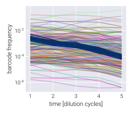
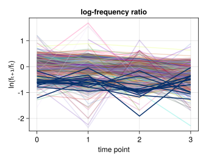
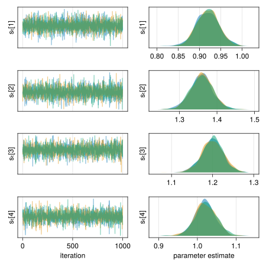

# BarBay

Welcome to the documentation of `BarBay.jl`! The accompanying paper,
*Bayesian inference of relative fitness on high-throughput pooled competition
assays*, explains all of the biological and mathematical background needed to
understand this package. Here, we mainly focus on how to use the package,
assuming the user already understands the objective of inferring the posterior
probability distribution of the relative fitness of mutant strains in a pooled
competition assay.

The package is divided into modules. Here's a brief description of the content
of each module, but please visit their respective documentations to understand
what each module is intended for.

- `utils`: Series of miscellaneous functions that make the data wrangling and
  processing much simpler.
- `stats`: Statistical functions used in the inference problem.
- `model`: [`Turing.jl`](https://turing.ml)-based Bayesian models used to infer
  the population mean fitness via the neutral lineages as well as the mutants'
  relative fitness.
- `vi`: The main module with which to implement the automatic differentiation
  variational inference modality of the inference pipeline.
- `mcmc`: The module with which to perform the Markov-Chain Monte Carlo sampling
  of the posterior distributions.

If you are interested in the mathematical details or want to get a quick 
reminder, please check the [math](@ref) tab.

## Contents

```@contents
```

## Example inference

To get you going with the package, let's walk through a basic inference pipeline
for one competition assay. Our ultimate goal consists of inferring the relative
fitness for each of the barcoded genotypes of interest. To that end, we assume
that the frequency time-series obeys the following equation
```math
f_{t+1}^{(b)} = f_{t}^{(b)} \mathrm{e}^{\left(s^{(b)} - \bar{s}_t \right)\tau},
\tag{1}
```
where ``f_{t}^{(b)}`` is the frequency of barcode ``b`` at the end of growth
cycle``t``, ``s^{(b)}`` is the relative fitness of this barcode, ``\bar{s}_t``
is the population mean fitness at cycle ``t``, and ``\tau`` is the time interval
between cycle ``t`` and ``t+1``.

The first step consists of importing the necessary packages. 

!!! note 
    We use `import` rather than the more common `using` command that most
    `Julia` tutorials and packages utilize. We find it better to keep the
    project organized, but feel free to use whatever is more convenient for you!

```julia
# Import Bayesian inference package
import BarBay

# Import libraries to manipulate data
import DataFrames as DF
import CSV
```

After having imported the libraries, we need to load our dataset into memory.

!!! warning
    `BarBay.jl` requires the dataset to follow the so-called [tidy
    format](http://www.jstatsoft.org/v59/i10/). Effectively, what this means is
    that each observation is stored as a single line in the table. So, instead
    of having all barcode counts for a particular time point across some row (or
    column), each barcode count for each time point gets its own line. See the
    example below to get a sense of what this tidy format implies.

```julia
# Import data
data = CSV.read("/path/to/data/tidy_data.csv", DF.DataFrame)
```
Here you will replace `"/path/to/data/"` with the directory where your data is
stored, and `"tidy_data.csv"` with the name of the file containing the data. The
resulting `DataFrame` looks something like this:
```
| time | barcode    | count | neutral | freq        |
|------|------------|-------|---------|-------------|
| 3    | neutral025 | 12478 | TRUE    | 0.000543716 |
| 4    | neutral025 | 10252 | TRUE    | 0.00034368  |
| 5    | neutral025 | 2883  | TRUE    | 6.74E-05    |
| 1    | mut001     | 1044  | FALSE   | 7.97E-05    |
| 2    | mut001     | 2010  | FALSE   | 0.000121885 |
| 3    | mut001     | 766   | FALSE   | 3.34E-05    |
| 4    | mut001     | 216   | FALSE   | 7.24E-06    |
| 5    | mut001     | 120   | FALSE   | 2.81E-06    |
| 1    | mut002     | 51484 | FALSE   | 0.003930243 |
```
The relevant columns in this data frame are:
- `barcode`: The unique ID that identifies the barcode. This can be anything
  that helps you identify each barcode.
- `count`: The number of raw reads for each particular barcode.
- `time`: The time point ID indicating the order in which samples were taken.
  These must not be in units of time, but simply a serial progression indicating
  the cycle number.
- `neutral`: Boolean indicator of whether the barcode belongs to a neutral
  lineage or not.

Let's take a look at the data. For this we import the extra package that
includes some plotting routines. 

!!! warning 
    To make the package more modular, we did not include plotting
    functionalities since this can interfere with the installation of the
    package on remote servers. Instead, the [accompanying paper
    repository](https://github.com/mrazomej/bayesian_fitness) includes a module
    (`BayesFitUtils`) that we can import to create basic plots using
    [Makie.jl](http://makie.juliaplots.org/). There are other options within the
    `Julia` ecosystem that users might be more familiar with for plotting.

The `BayesFitUtil.viz` module has several
[`Makie.jl`](https://docs.makie.org/stable/)-based functions to easily display
the data. Let's import the necessary plotting libraries

```julia
# Import package with useful plotting functions for our dataset
import BayesFitUtils
# Import plotting libraries
using CairoMakie
import ColorSchemes
```

First, let's plot the barcode frequency trajectories. For this, we use the
convenient [`BayesFitUtils.viz.bc_time_series!`] function.

```julia
# Initialize figure
fig = Figure(resolution=(350, 300))

# Add axis
ax = Axis(
    fig[1, 1], xlabel="time [dilution cycle]", ylabel="barcode frequency", yscale=log10
)

# Plot mutant barcode trajectories
BayesFitUtils.viz.bc_time_series!(
    ax,
    data[.!(data.neutral), :],
    quant_col=:freq,
    zero_lim=0,
    alpha=0.35
)

# Plot neutral barcode trajectories
BayesFitUtils.viz.bc_time_series!(
    ax,
    data[data.neutral, :],
    quant_col=:freq,
    zero_lim=0,
    color=ColorSchemes.Blues_9[end],
)
```

We highlight the neutral barcodes⸺defined to have relative fitness
``s^{(n)}=0``⸺with dark blue lines. The rest of the light-color lines correspond
to individual barcodes.



We can rewrite Eq. (1) as
```math
\frac{1}{\tau} \ln \frac{f_{t+1}^{(b)}}{f_{t}^{(b)}} = 
\left(s^{(b)} - \bar{s}_t \right).
\tag{2}
```
In this form, we can se that the relevant quantity we need to infer the values
of the population mean fitness ``\bar{s}_t`` and the barcode relative fitness
``s^{(b)}`` are not the frequencies themselves, but the log ratio of these
frequencies between two adjacent time points. Let's plot this log frequency
ratio using the [`BayesFitUtils.viz.logfreq_ratio_time_series!`] function.

!!! note
    For plotting purposes, we will use a naive estimate of the barcode
    frequencies by normalizing the number of reads by the total number of reads
    at each time point. In our inference pipeline, we estimate the frequency 
    given the number of reads to include the uncertainty when converting one to
    the other.

```julia
# Initialize figure
fig = Figure(resolution=(400, 300))

# Add axis
ax = Axis(fig[1, 1], xlabel="time [dilution cycle]", ylabel="ln(fₜ₊₁/fₜ)")

# Plot mutant barcode trajectories
BayesFitUtils.viz.logfreq_ratio_time_series!(
    ax,
    data[.!(data.neutral), :],
    alpha=0.3
)

# Plot neutral barcode trajectories
BayesFitUtils.viz.logfreq_ratio_time_series!(
    ax,
    data[data.neutral, :],
    color=ColorSchemes.Blues_9[end],
)
```
!!! tip
    We expect is to see these log-frequency ratios as relatively flat lines.
    Especially for the neutral lineages.




### Using the neutral lineages to determine our priors

One of the feature of Bayesian analysis is that we can include prior information
into our inference task that encodes our domain expertise. For analysis with a
lot of data, as long as the prior is broad-enough, this becomes less relevant.
However, although we have a lot of data for multiple barcodes, we are actually
in the low-data regime since for each barcode we typically have on the order of
4-5 time point measurements. Thus, defining appropriate priors is important for
our inference pipeline. Unfortunately, we do not necessarily measure each
genotype multiple times within the same experiment to get a sense of the
expected variation in our measurements. An exception to this are the neutral
barcodes. These barcodes represent multiple measurement of allegedly the same
reference genotype. Therefore, we can use the variability within these
measurements to define the priors for our inference. Let's now take the neutrals
data and obtain these parameters

!!! note
    `BarBay.jl` includes the function `naive_prior` within the
    [stats](@ref) module to compute priors for some of the parameters based on
    the neutral lineages data. We point the user to the accompanying paper to
    see details on these prior selection.

```julia
# Compute naive priors from neutral strains
naive_priors = BarBay.stats.naive_prior(data)

# Select standard deviation parameters
s_pop_prior = hcat(
    naive_priors[:s_pop_prior],
    repeat([0.05], length(naive_priors[:s_pop_prior]))
)

logσ_pop_prior = hcat(
    naive_priors[:logσ_pop_prior],
    repeat([1.0], length(naive_priors[:logσ_pop_prior]))
)

logσ_bc_prior = [StatsBase.mean(naive_priors[:logσ_pop_prior]), 1.0]

logλ_prior = hcat(
    naive_priors[:logλ_prior],
    repeat([3.0], length(naive_priors[:logλ_prior]))
)
```

### Running the inference

With these priors in hand, we can run the inference. For this, we use the
[`BarBay.vi.advi`](@ref) function from the [vi](@ref) module. The main
parameters we need to define are:
- `:data`: Tidy data frame containing the raw barcode counts.
- `:outputname`: String defining the pattern for the output file. This can be
  something related to the dataset. For example, the growth media, or the date
  of the experiment, of whatever metadata used to distinguish different
  datasets.
- `:model`: Bayesian model from the [model](@ref) module that defines the
  posterior distribution to be sampled.
- `:model_kwargs`: The parameters required by the `model` function.
- `:advi`: Indicating the ADVI implementation with the corresponding number of
  samples and steps.
- `opt`: Optimization algorithm for ADVI.

To speed-up the computation, we will use
[`ReverseDiff.jl`](https://github.com/JuliaDiff/ReverseDiff.jl) as the auto
differentiation backend (see
[`Turing.jl`](https://turing.ml/v0.22/docs/using-turing/autodiff) documentation
for more information on this). Let's import the necessary packages and set the
differentiation backend options.

```julia
# Import library to perform Bayesian inference
import Turing

# Import AutoDiff backend
using ReverseDiff

# Import Memoization
using Memoization

# Set AutoDiff backend
Turing.setadbackend(:reversediff)
# Allow system to generate cache to speed up computation
Turing.setrdcache(true)
```

For this dataset, we use the [`BarBay.model.fitness_normal`](@ref)
model from the [model](@ref) module. Now, we can compile all of the
necessary parameters into a dictionary.

```julia
# Define number of samples and steps
n_samples = 1
n_steps = 3_000

# Define function parameters
param = Dict(
    :data => data,
    :outputname => "./output/advi_meanfield_" *
                   "$(lpad(n_samples, 2, "0"))samples_$(n_steps)steps",
    :model => BarBay.model.fitness_normal,
    :model_kwargs => Dict(
        :s_pop_prior => s_pop_prior,
        :logσ_pop_prior => logσ_pop_prior,
        :logσ_bc_prior => logσ_bc_prior,
        :s_bc_prior => [0.0, 1.0],
        :logλ_prior => logλ_prior,
    ),
    :advi => Turing.ADVI(n_samples, n_steps),
    :opt => Turing.TruncatedADAGrad(),
)
```

Next, we run the inference.

```julia
BarBay.vi.advi(; param...)
```

## Inference output

After running the inference, the output of is a `.csv` file of the form
```
| mean                  | std                  | varname   | vartype          | rep | env  | id     |
|-----------------------|----------------------|-----------|------------------|-----|------|--------|
| 0.6769813021009923    | 0.019270434240452546 | s̲ₜ[1]    | pop_mean_fitness | R1  | env1 | N/A    |
| 0.5979391468267903    | 0.023068814619647663 | s̲ₜ[2]    | pop_mean_fitness | R1  | env1 | N/A    |
| 0.7794031847044068    | 0.021637905105449048 | s̲ₜ[3]    | pop_mean_fitness | R1  | env1 | N/A    |
| 1.097531601258874     | 0.020140458476711063 | s̲ₜ[4]    | pop_mean_fitness | R1  | env1 | N/A    |
| -1.1349279694117884   | 0.13764164137709486  | logσ̲ₜ[1] | pop_std          | R1  | env1 | N/A    |
| -0.8537538300547914   | 0.14427221564497342  | logσ̲ₜ[2] | pop_std          | R1  | env1 | N/A    |
| -1.0036841099650615   | 0.14850736993662278  | logσ̲ₜ[3] | pop_std          | R1  | env1 | N/A    |
| -1.0111319869238307   | 0.13429835511246288  | logσ̲ₜ[4] | pop_std          | R1  | env1 | N/A    |
| -0.023508979117674522 | 0.42814608044575164  | s̲⁽ᵐ⁾[1]  | bc_fitness       | R1  | env1 | mut001 |
| -0.08443525829413444  | 0.2749553846185592   | s̲⁽ᵐ⁾[2]  | bc_fitness       | R1  | env1 | mut002 |
| -0.05274382497169921  | 0.1535891599128269   | s̲⁽ᵐ⁾[3]  | bc_fitness       | R1  | env1 | mut003 |
| 0.14655295685583677   | 0.32454211197027244  | s̲⁽ᵐ⁾[4]  | bc_fitness       | R1  | env1 | mut004 |
| 0.06093015139986163   | 0.055690708045292796 | s̲⁽ᵐ⁾[5]  | bc_fitness       | R1  | env1 | mut005 |
| 0.07170404879708663   | 0.2969475992920767   | s̲⁽ᵐ⁾[6]  | bc_fitness       | R1  | env1 | mut006 |
| 0.03640967790708551   | 0.2664593948070634   | s̲⁽ᵐ⁾[7]  | bc_fitness       | R1  | env1 | mut007 |
```

!!! note
    Recall that our implementation of variational inference assumes the true
    posterior distribution can be approximated by a multivariate Gaussian
    distribution with a diagonal covariance matrix. Therefore, the marginal
    posterior distribution for each of the inferred parameters can be fully
    parametrized with two numbers: the mean and the standard deviation.

The columns of this file are

- `mean`: The mean of the marginal posterior distribution for the variable.
- `std`: The standard deviation of the marginal posterior distribution for the
  variable.
- `varname`: The name of the variable within the `Turing.jl` model. For the most
  part, you can ignore this column.
- `vartype`: Description of the type of parameter. The types are:
    - `pop_mean_fitness`: Population mean fitness value `s̲ₜ`.
    - `pop_error`: (Nuisance parameter) Log of standard deviation in the
      likelihood function for the neutral lineages.
    - `bc_fitness`: Mutant relative fitness `s⁽ᵐ⁾`.
    - `bc_hyperfitness`: For hierarchical models, mutant hyperparameter that
      connects the fitness over multiple experimental replicates or multiple
      genotypes `θ⁽ᵐ⁾`.
    - `bc_noncenter`: (Nuisance parameter) For hierarchical models, non-centered
      samples used to connect the experimental replicates to the hyperparameter
      `θ̃⁽ᵐ⁾`.
    - `bc_deviations`: (Nuisance parameter) For hierarchical models, samples
      that define the log of the deviation from the hyperparameter fitness value
      `logτ⁽ᵐ⁾`.
    - `bc_error`: (Nuisance parameter) Log of standard deviation in the
      likelihood function for the mutant lineages.
    - `freq`: (Nuisance parameter) Log of the Poisson parameter used to define
      the frequency of each lineage.
- `rep`: Experimental replicate number.
- `env`: Environment for each parameter.
- `id`: Mutant or neutral strain ID.

## Validating the inference

To visualize the performance of the inference pipeline in fitting the fitness
model to data, we can compute the so-called posterior predictive checks (PPC).
In short, the PPC consists of repeatedly generating synthetic datasets in
agreement with the results from the inference results. In other words, we use
the resulting parameter values from the ADVI inference to generate possible
datasets in agreement with the inferred values.

The first step consists of loading the inference results into memory

```julia
# Read ADVI results
df_advi = CSV.read("/path/to/advi/advi_results.csv", DF.DataFrame)
```

Next, we generate random samples from the posterior distribution. The idea being
that we will generate synthetic data for each of these parameter samples 
consistent with our data. With a large enough number of samples, we should be
able to determine the range where we expect our data to lie.

```julia
# Define number of samples
n_samples = 10_000

# Sample from posterior MvNormal
df_samples = DF.DataFrame(
    Random.rand(
        Distributions.MvNormal(
            df_advi.mean, LinearAlgebra.Diagonal(df_advi.std .^ 2)
        ),
        n_samples
    )',
    df_advi.varname
)
```

Finally, we can use the [`BarBay.stats.logfreq_ratio_popmean_ppc`](@ref)
function for neutral lineages or
[`BarBay.stats.logfreq_ratio_bc_ppc`](@ref) for non-neutral lineages to
generate the corresponding posterior predictive checks. In the code that
follows, we embed this ppc sampling within the generation of diagnostic plots.

!!! warning
    We remind users that the custom plotting functions are **not** included in
    the `BarBay.jl` package. The following code is only meant to serve as
    a guidance for users to know how to generate diagnostic plots.

```julia
# Initialize figure
fig = Figure(resolution=(600, 600))

# Add grid layout for posterior predictive checks
gl_ppc = fig[1, 1] = GridLayout()

# Define number of posterior predictive check samples
n_ppc = 500
# Define quantiles to compute
qs = [0.95, 0.675, 0.05]

# Define number of rows and columns
n_row, n_col = [4, 4]

# List example barcodes to plot
bc_plot = StatsBase.sample(
    eachrow(DF.sort(df_fitness, :mean)),
    n_row * n_col,
    replace=false,
    ordered=true
)

# Initialize plot counter
counter = 1
# Loop through rows
for row in 1:n_row
    # Loop through columns
    for col in 1:n_col
        # Add axis
        local ax = Axis(gl_ppc[row, col], aspect=AxisAspect(1.25))

        # Check if first first entry
        if (row == 1) & (col == 1)
            # Define dictionary with corresponding parameters for variables
            # needed for the posterior predictive checks
            param = Dict(
                :population_mean_fitness => :s̲ₜ,
                :population_std_fitness => :σ̲ₜ,
            )

            # Define colors
            local colors = get(
                ColorSchemes.Purples_9, LinRange(0.5, 1.0, length(qs))
            )

            # Compute posterior predictive checks
            local ppc_mat = BarBay.stats.logfreq_ratio_popmean_ppc(
                df_samples, n_ppc; model=:normal, param=param
            )

            # Define time
            t = vec(collect(axes(ppc_mat, 2)) .+ 1)

            # Plot posterior predictive checks
            BayesFitUtils.viz.ppc_time_series!(
                ax, qs, ppc_mat; colors=colors, time=t
            )

            # Plot log-frequency ratio of neutrals
            BayesFitUtils.viz.logfreq_ratio_time_series!(
                ax,
                data[data.neutral, :];
                freq_col=:freq,
                color=:black,
                alpha=1.0,
                linewidth=1.5
            )

            # Hide axis decorations
            hidedecorations!.(ax, grid=false)

            ax.title = "neutral lineages"
            # ax.titlesize = 18

            counter += 1

            continue
        end # if

        # Extract data
        data_bc = DF.sort(
            data[data.barcode.==bc_plot[counter].id, :], :time
        )

        # Define colors
        local colors = get(ColorSchemes.Blues_9, LinRange(0.5, 1.0, length(qs)))

        # Define dictionary with corresponding parameters for variables needed
        # for the posterior predictive checks
        local param = Dict(
            :bc_mean_fitness => Symbol(bc_plot[counter].varname),
            :bc_std_fitness => Symbol(
                replace(bc_plot[counter].varname, "s" => "logσ")
            ),
            :population_mean_fitness => :s̲ₜ,
        )
        # Compute posterior predictive checks
        local ppc_mat = BarBay.stats.logfreq_ratio_bc_ppc(
            df_samples, n_ppc; model=:normal, param=param
        )
        # Plot posterior predictive checks
        BayesFitUtils.viz.ppc_time_series!(
            ax, qs, ppc_mat; colors=colors
        )

        # Add scatter of data
        scatterlines!(ax, diff(log.(data_bc.freq)), color=:black, linewidth=2.0)

        # Define fitness ranges to display in title
        vals = [
            round(bc_plot[counter].mean; sigdigits=2),
            round(bc_plot[counter].std; sigdigits=2),
        ]

        # Add title
        ax.title = "s⁽ᵐ⁾= $(vals[1])±$(vals[2])"

        ## == Plot format == ##

        # Hide axis decorations
        hidedecorations!.(ax, grid=false)

        # Update counter
        global counter += 1
    end  # for
end # for

# Add x-axis label
Label(gl_ppc[end, :, Bottom()], "time points", fontsize=22)
# Add y-axis label
Label(gl_ppc[:, 1, Left()], "ln(fₜ₊₁/fₜ)", rotation=π / 2, fontsize=22)
# Set spacing
rowgap!(gl_ppc, 0)
colgap!(gl_ppc, 4)
```



These are examples of the posterior predictive checks for all neutral lineages
(upper left panel) and a subset of representative mutant lineages. Shaded
regions represent the 95%, 68%, and 5% credible regions for the data. The
reported errors above the plot represent the 68% credible region on the mutant
relative fitness marginal distribution.

As we can see, the data lies within the quantiles, suggesting the inference
worked and the model is able to capture the general trend of the barcode
trajectories!