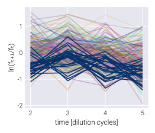

# BayesFitness

Welcome to the documentation of `BayesFitness.jl`! The accompanying paper,
*Bayesian inference of relative fitness on high-throughput pooled competition
assays*, explains all of the biological and mathematical background needed to
understand this package. Here, we only focus on how to use the package, assuming
the user already understands the objective of inferring the posterior
probability distribution of the relative fitness of mutant strains in a pooled
competition assay.

The package is divided into modules. Here's a brief description of the content
of each module, but please visit their respective documentations to understand
what each module is intended for.

- `utils`: Series of miscellaneous functions that make the data wrangling and
  processing much simpler.
- `stats`: Statistical functions used in the inference problem.
- `model`: [`Turing.jl`](https://turing.ml)-based Bayesian models used to infer
  the population mean fitness via the neutral lineages as well as the mutants'
  relative fitness.
- `vi`: The main module with which to implement the automatic differentiation
  variational inference modality of the inference pipeline.
- `mcmc`: The module with which to perform the Markov-Chain Monte Carlo sampling
  of the posterior distributions.
  
## Example inference

To get you going with the package, let's walk through a basic inference pipeline
for one competition assay. Our ultimate goal consists of inferring the relative
fitness for each of the barcoded genotypes of interest. To that end, we assume
that the frequency time-series obeys the following equation
```math
f_{t+1}^{(b)} = f_{t}^{(b)} \mathrm{e}^{\left(s^{(b)} - \bar{s}_t \right)\tau},
\tag{1}
```
where ``f_{t}^{(b)}`` is the frequency of barcode ``b`` at the end of growth
cycle``t``, ``s^{(b)}`` is the relative fitness of this barcode, ``\bar{s}_t``
is the population mean fitness at cycle ``t``, and ``\tau`` is the time interval
between cycle ``t`` and ``t+1``.

The first step consists of importing the necessary packages. 

!!! note 
    We use `import` rather than the more common `using` command that most
    `Julia` tutorials and packages utilize. We find it better to keep the
    project organized, but feel free to use whatever is more convenient for you!

```julia
# Import Bayesian inference package
import BayesFitness

# Import libraries to manipulate data
import DataFrames as DF
import CSV
```

After having imported the libraries, we need to load our dataset into memory.

!!! warning
    `BayesFitness.jl` requires the dataset to follow the so-called [tidy
    format](http://www.jstatsoft.org/v59/i10/). Effectively, what this means is
    that each observation is stored as a single line in the table. So, instead
    of having all barcode counts for a particular time point across some row (or
    column), each barcode count for each time point gets its own line. See the
    example below to get a sense of what this tidy format implies.

```julia
# Import data
data = CSV.read("~/git/BayesFitness/test/data/data_example_01.csv", DF.DataFrame)
```
Here you will replace `"~/git/BayesFitness/test/data"` with the directory where
your data is stored, and `"data_example_01.csv"` with the name of the file
containing the data. The resulting `DataFrame` looks something like this:
```
| time | barcode    | count | neutral | freq        |
|------|------------|-------|---------|-------------|
| 3    | neutral025 | 12478 | TRUE    | 0.000543716 |
| 4    | neutral025 | 10252 | TRUE    | 0.00034368  |
| 5    | neutral025 | 2883  | TRUE    | 6.74E-05    |
| 1    | mut001     | 1044  | FALSE   | 7.97E-05    |
| 2    | mut001     | 2010  | FALSE   | 0.000121885 |
| 3    | mut001     | 766   | FALSE   | 3.34E-05    |
| 4    | mut001     | 216   | FALSE   | 7.24E-06    |
| 5    | mut001     | 120   | FALSE   | 2.81E-06    |
| 1    | mut002     | 51484 | FALSE   | 0.003930243 |
```
The relevant columns in this data frame are:
- `barcode`: The unique ID that identifies the barcode. This can be anything
  that helps you identify each barcode.
- `count`: The number of raw reads for each particular barcode.
- `time`: The time point ID indicating the order in which samples were taken.
  These must not be in units of time, but simply a serial progression indicating
  the cycle number.
- `neutral`: Boolean indicator of whether the barcode belongs to a neutral
  lineage or not.

Let's take a look at the data. For this we import the extra package that
includes some plotting routines. 

!!! warning 
    To make the package more modular, we did not include plotting
    functionalities since this can interfere with the installation of the
    package on remote servers. Instead, the [accompanying paper
    repository](https://github.com/mrazomej/bayesian_fitness) includes a module
    (`BayesFitUtils`) that we can import to create basic plots using
    [Makie.jl](http://makie.juliaplots.org/). There are other options within the
    `Julia` ecosystem that users might be more familiar with for plotting.

The `BayesFitUtil.viz` module has several
[`Makie.jl`](https://docs.makie.org/stable/)-based functions to easily display
the data. Let's import the necessary plotting libraries

```julia
# Import package with useful plotting functions for our dataset
import BayesFitUtils
# Import plotting libraries
using CairoMakie
import ColorSchemes
```

First, let's plot the barcode frequency trajectories. For this, we use the
convenient [`BayesFitUtils.viz.bc_time_series!`] function.

```julia
# Initialize figure
fig = Figure(resolution=(350, 300))

# Add axis
ax = Axis(
    fig[1, 1], xlabel="time", ylabel="barcode frequency", yscale=log10
)

# Plot mutant barcode trajectories
BayesFitUtils.viz.bc_time_series!(
    ax,
    data[.!(data.neutral), :],
    quant_col=:freq,
    zero_lim=0,
    alpha=0.35
)

# Plot neutral barcode trajectories
BayesFitUtils.viz.bc_time_series!(
    ax,
    data[data.neutral, :],
    quant_col=:freq,
    zero_lim=0,
    color=ColorSchemes.Blues_9[end],
)
```

We highlight the neutral barcodes⸺defined to have relative fitness
``s^{(n)}=0``⸺with dark blue lines. The rest of the light-color lines correspond
to individual barcodes.


We can rewrite Eq. (1) as
```math
\frac{1}{\tau} \ln \frac{f_{t+1}^{(b)}}{f_{t}^{(b)}} = 
\left(s^{(b)} - \bar{s}_t \right).
\tag{2}
```
In this form, we can se that the relevant quantity we need to infer the values
of the population mean fitness ``\bar{s}_t`` and the barcode relative fitness
``s^{(b)}`` are not the frequencies themselves, but the log ratio of these
frequencies between two adjacent time points. Let's plot this log frequency
ratio using the [`BayesFitUtils.viz.logfreq_ratio_time_series!`] function.

!!! note
    For plotting purposes, we will use a naive estimate of the barcode
    frequencies by normalizing the number of reads by the total number of reads
    at each time point. In our inference pipeline, we estimate the frequency 
    given the number of reads to include the uncertainty when converting one to
    the other.

```julia
# Initialize figure
fig = Figure(resolution=(400, 300))

# Add axis
ax = Axis(fig[1, 1], xlabel="time", ylabel="ln(fₜ₊₁/fₜ)")

# Plot mutant barcode trajectories
BayesFitUtils.viz.logfreq_ratio_time_series!(
    ax,
    data[.!(data.neutral), :],
    alpha=0.3
)

# Plot neutral barcode trajectories
BayesFitUtils.viz.logfreq_ratio_time_series!(
    ax,
    data[data.neutral, :],
    color=ColorSchemes.Blues_9[end],
)
```
!!! tip
    We expect is to see these log-frequency ratios as relatively flat lines.
    Especially for the neutral lineages.




### Using the neutral lineages to determine our priors

One of the feature of Bayesian analysis is that we can include prior information
into our inference task that encodes our domain expertise. For analysis with a
lot of data, as long as the prior is broad-enough, this becomes less relevant.
However, although we have a lot of data for multiple barcodes, we are actually
in the low-data regime since for each barcode we typically have on the order of
4-5 time point measurements. Thus, defining appropriate priors is important for
our inference pipeline. Unfortunately, we do not necessarily measure each
genotype multiple times within the same experiment to get a sense of the
expected variation in our measurements. An exception to this are the neutral
barcodes. These barcodes represent multiple measurement of allegedly the same
reference genotype. Therefore, we can use the variability within these
measurements to define the priors for our inference. Let's now take the neutrals
data and obtain these parameters

!!! note
    `BayesFitness.jl` includes the function `naive_prior` within the
    [stats](@ref) module to compute priors for some of the parameters based on
    the neutral lineages data. We point the user to the accompanying paper to
    see details on these prior selection.

```julia
# Compute naive priors from neutral strains
naive_priors = BayesFitness.stats.naive_prior(data)

# Select standard deviation parameters
s_pop_prior = hcat(
    naive_priors[:s_pop_prior],
    repeat([0.05], length(naive_priors[:s_pop_prior]))
)

logσ_pop_prior = hcat(
    naive_priors[:logσ_pop_prior],
    repeat([1.0], length(naive_priors[:logσ_pop_prior]))
)

logσ_bc_prior = [StatsBase.mean(naive_priors[:logσ_pop_prior]), 1.0]

logλ_prior = hcat(
    naive_priors[:logλ_prior],
    repeat([3.0], length(naive_priors[:logλ_prior]))
)
```

### Running the inference

With these priors in hand, we can run the inference. For this, we use the
[`BayesFitness.vi.advi`](@ref) function from the [vi](@ref) module. The main
parameters we need to define are:
- `:data`: Tidy data frame containing the raw barcode counts.
- `:outputname`: String defining the pattern for the output file. This can be
  something related to the dataset. For example, the growth media, or the date
  of the experiment, of whatever metadata used to distinguish different
  datasets.
- `:model`: Bayesian model from the [model](@ref) module that defines the
  posterior distribution to be sampled.
- `:model_kwargs`: The parameters required by the `model` function.
- `:advi`: Indicating the ADVI implementation with the corresponding number of
  samples and steps.
- `opt`: Optimization algorithm for ADVI.

To speed-up the computation, we will use
[`ReverseDiff.jl`](https://github.com/JuliaDiff/ReverseDiff.jl) as the auto
differentiation backend (see
[`Turing.jl`](https://turing.ml/v0.22/docs/using-turing/autodiff) documentation
for more information on this). Let's import the necessary packages and set the
differentiation backend options.

```julia
# Import library to perform Bayesian inference
import Turing

# Import AutoDiff backend
using ReverseDiff

# Import Memoization
using Memoization

# Set AutoDiff backend
Turing.setadbackend(:reversediff)
# Allow system to generate cache to speed up computation
Turing.setrdcache(true)
```

For this dataset, we use the [`BayesFitness.model.fitness_normal`](@ref)
model from the [model](@ref) module. Now, we can compile all of the
necessary parameters into a dictionary.

```julia
# Define number of samples and steps
n_samples = 1
n_steps = 3_000

# Define function parameters
param = Dict(
    :data => data,
    :outputname => "./output/advi_meanfield_" *
                   "$(lpad(n_samples, 2, "0"))samples_$(n_steps)steps",
    :model => BayesFitness.model.fitness_normal,
    :model_kwargs => Dict(
        :s_pop_prior => s_pop_prior,
        :logσ_pop_prior => logσ_pop_prior,
        :logσ_bc_prior => logσ_bc_prior,
        :s_bc_prior => [0.0, 1.0],
        :logλ_prior => logλ_prior,
    ),
    :advi => Turing.ADVI(n_samples, n_steps),
    :opt => Turing.TruncatedADAGrad(),
)
```

Next, we run the inference.

```julia
BayesFitness.vi.advi(; param...)
```

The output of this function is a `.csv` file with `outputname`.

### Validating the inference

The first step to check the inference results is to load the MCMC chain into
memory. For this, we need to load the `JLD2.jl` package as well as the
`MCMCChains.jl` package that allows us to manipulate the data structure
containing the MCMC chains.

```julia
# Import package to search file name
import Glob
# Import package to load .jld2 files into memory
import JLD2
# Import package to manipulate MCMCChains.Chain objects
import MCMCChains

# Define file
file = first(Glob.glob("./output/chain_joint_fitness_*"))

# Load list of mutants and MCMC chain
ids, chn = values(JLD2.load(file))
```

To diagnose the inference, it is useful to plot both the MCMC traces for each
walker as well as the resulting density plots. Let's first do this for the
population mean fitness-related values ``\underline{\bar{s}}_t`` and
``\underline{\bar{\sigma}}_t``. To do this, we feed the `chain` data structure
to the `BayesFitnUtils.viz.mcmc_trace_density!` function to
automatically generate these plots.

```julia
# Extract variable names
var_names = vcat(
    [MCMCChains.namesingroup(chn, :s̲ₜ), MCMCChains.namesingroup(chn, :σ̲ₜ)]...
)

# Initialize figure
fig = Figure(resolution=(600, 800))

# Generate mcmc_trace_density! plot
BayesFitUtils.viz.mcmc_trace_density!(fig, chn[var_names]; alpha=0.5)
```

!!! tip 
    What we want to see from these plots is that all traces look relatively
    similar, with no big gaps where the walker got stuck. Furthermore, we want
    to see that all the densities converged to very similar-looking
    distributions. That is indeed the case for our dataset.


Another way of assessing the output of this inference step is to plot the
posterior predictive checks against the data. The logic behind the posterior
predictive checks is the following: before performing the inference on the
parameters we seek to learn form the data, we have a prior belief of what those
values can be encoded in our prior distribution. We update this prior belief
after observing the experimental data given our likelihood function that
captures our model for the data generating process. Thus, the posterior
distribution of the parameter values contains our updated belief for what the
parameter values can be. Therefore, we can sample out of this parameter
posterior distribution and feed such parameters to our likelihood function to
generate synthetic data. The expectation is that this simulated data should
capture the range of experimental data we observed if the model and the inferred
parameters describe the data generation process.

For this particular case of the population mean fitness, we can use the
[`BayesFitness.stats.logfreq_ratio_mean_ppc`](@ref) from the
[`stats`](./stats.md) module to compute the posterior predictive checks. What
this function does is to generate samples for the log-frequency ratios used to
infer the population mean fitness values.

!!! info
    Note that the [`BayesFitness.stats.logfreq_ratio_mean_ppc`](@ref) function
    has methods to work with either `MCMCChains.Chains` objects or with tidy
    `DataFrames.DataFrame`. This allows you to use the data structure you are
    more comfortable working with.

```julia
# Define dictionary with corresponding parameters for variables needed for
# the posterior predictive checks
param = Dict(
    :population_mean_fitness => :s̲ₜ,
    :population_std_fitness => :σ̲ₜ,
)

# Define number of posterior predictive check samples
n_ppc = 500

# Define colors
colors = get(ColorSchemes.Blues_9, LinRange(0.25, 1.0, length(qs)))

# Compute posterior predictive checks
ppc_mat = BayesFitness.stats.logfreq_ratio_mean_ppc(
    chn, n_ppc; param=param
)
```

Once we generate these samples, we can plot the quantiles of the simulated data
with different shades. The `BayesFitUtils.viz.ppc_time_series!` function makes
this plotting really simple. Let us plot the standard 68-95 as well as the 5
percentile with different shades of blue and then add the data on top of these
shaded areas

!!! tip
    What we expect from this plot is to see that most of the experimental data
    falls within the range of the simulated data, meaning that the model and the
    inferred parameters can reproduce the range of our observations.

```julia
# Define quantiles to compute
qs = [0.05, 0.68, 0.95]

# Define colors
colors = get(ColorSchemes.Blues_9, LinRange(0.25, 1.0, length(qs)))

# Define time
t = vec(collect(axes(ppc_mat, 2)) .+ 1)

# Initialize figure
fig = Figure(resolution=(450, 350))

# Add axis
ax = Axis(
    fig[1, 1],
    xlabel="time point",
    ylabel="ln(fₜ₊₁/fₜ)",
    title="neutral lineages PPC"
)

# Plot posterior predictive checks
BayesFitUtils.viz.ppc_time_series!(
    ax, qs, ppc_mat; colors=colors, time=t
)

# Plot log-frequency ratio of neutrals
BayesFitUtils.viz.logfreq_ratio_time_series!(
    ax,
    data[data.neutral, :];
    freq_col=:freq,
    color=:black,
    alpha=1.0,
    linewidth=2
)
```


This plot shows that the range of inferred population mean fitnesses does
capture the log-frequency ratios of the neutral lineages. 

Let us repeat this analysis for the mutants. Obviously, with the incredibly
large number of unique mutant barcodes, it would be difficult to visualize all
trace-density plots as well as all posterior predictive checks. But we can take
a random subset of them to make sure they look okay in general.

```julia

# Find columns with mutant fitness values and error
s_names = MCMCChains.namesingroup(chn, :s̲⁽ᵐ⁾)

# Define barcodes to include
var_names = StatsBase.sample(s_names, 8)

# Initialize figure
fig = Figure(resolution=(600, 800))

# Generate mcmc_trace_density! plot
BayesFitUtils.viz.mcmc_trace_density!(fig, chn[var_names]; alpha=0.5)
```


All these example density and trace plots look good. Next, let us compute and
plot some example posterior predictive checks for a few mutants. 

```julia
# Define number of posterior predictive check samples
n_ppc = 500
# Define quantiles to compute
qs = [0.95, 0.675, 0.05]

# Define number of rows and columns
n_row, n_col = [4, 4]

# Initialize figure
fig = Figure(resolution=(300 * n_col, 300 * n_row))

# List example barcodes to plot
bc_plot = StatsBase.sample(eachrow(df_summary), n_row * n_col)

# Initialize plot counter
counter = 1
# Loop through rows
for row in 1:n_row
    # Loop through columns
    for col in 1:n_col
        # Add axis
        ax = Axis(fig[row, col])

        # Extract data
        data_bc = DF.sort(
            data[data.barcode.==bc_plot[counter].barcode, :], :time
        )

        # Define colors
        colors = get(ColorSchemes.Blues_9, LinRange(0.5, 1.0, length(qs)))

        # Define dictionary with corresponding parameters for variables needed
        # for the posterior predictive checks
        param = Dict(
            :mutant_mean_fitness => Symbol(bc_plot[counter].variable),
            :mutant_std_fitness => Symbol(
                replace(bc_plot[counter].variable, "s" => "σ")
            ),
            :population_mean_fitness => :s̲ₜ,
        )
        # Compute posterior predictive checks
        ppc_mat = BayesFitness.stats.logfreq_ratio_mutant_ppc(
            chn, n_ppc; param=param
        )
        # Plot posterior predictive checks
        BayesFitUtils.viz.ppc_time_series!(
            ax, qs, ppc_mat; colors=colors
        )

        # Add scatter of data
        scatterlines!(ax, diff(log.(data_bc.freq)), color=:black, linewidth=2.5)

        # Add title
        ax.title = "barcode $(first(data_bc.barcode))"
        ax.titlesize = 18

        ## == Plot format == ##

        # Hide axis decorations
        hidedecorations!.(ax, grid=false)

        # Update counter
        global counter += 1
    end  # for
end # for

# Add x-axis label
Label(fig[end, :, Bottom()], "time points", fontsize=22)
# Add y-axis label
Label(fig[:, 1, Left()], "ln(fₜ₊₁/fₜ)", rotation=π / 2, fontsize=22)
```


We can see that indeed the recovered fitness value greatly agrees with the data.

This concludes the example inference pipeline. We invited you to explore more
the potential in the package and please send any comments/requests through the
GitHub repository issues.

## Contents

```@contents
```